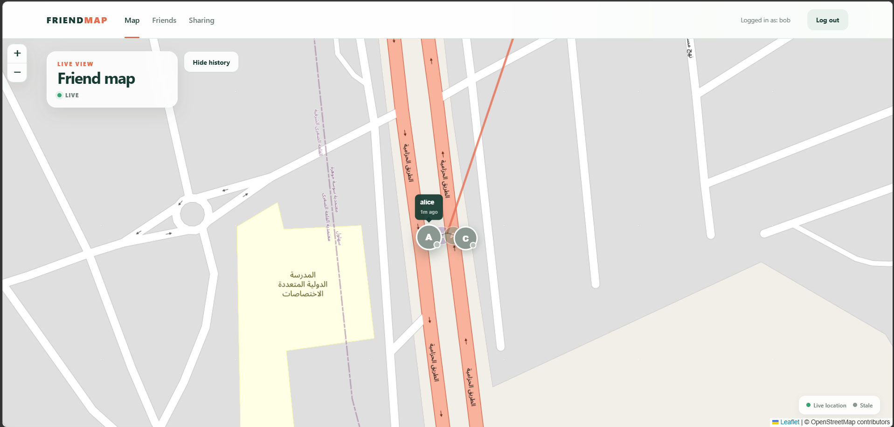
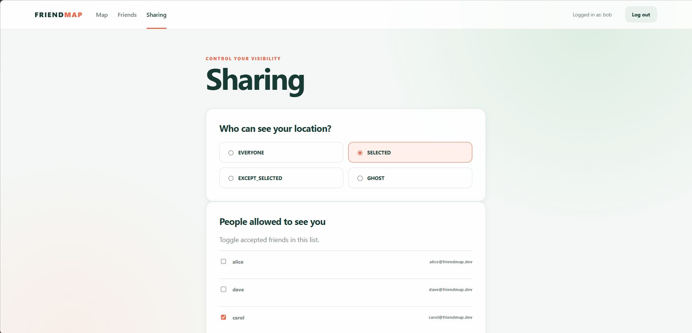
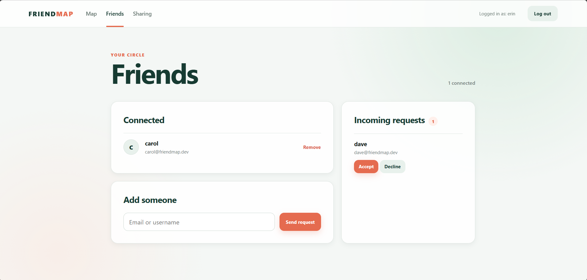

# FriendMap

Real-time location sharing between friends, with privacy controls (Ghost / Everyone / Selected / Except-selected), fast revocation when a user changes who can see them — plus direct messaging, online presence, and meetup planning (trips): invite friends, pick a meet-in-the-middle or fixed spot, and track who's arrived — live.

Stack: NestJS (TypeScript, strict) · Prisma · PostgreSQL · Redis · Socket.IO · Vue 3 · Pinia · Leaflet · Docker Compose · Kubernetes.

## Features

### Core Functionality
- **Real-time Location Sharing**: Share your live location with friends via WebSocket
- **Privacy Controls**: Four sharing modes (Ghost, Everyone, Selected, Except-selected)
- **Fast Revocation**: Visibility changes take effect in under 2 seconds
- **Friendship Management**: Send, accept, reject, and remove friend requests
- **Direct Messaging**: Real-time chat with friends, including read receipts and secure image attachments
- **Online Presence**: See who's online, updated live via Redis-backed presence
- **Meetup Planning (Trips)**: Plan meetups with friends — create a trip, invite accepted friends, propose a time, and archive or leave it when you're done
- **Meet-In-The-Middle Spots**: On a trip, the default AUTO meetup is computed as the geographic center of all members; any member can pin a fixed location instead
- **Live Trip Map**: Activating a trip on the main map streams every member's location into a trip layer — even friends who've otherwise disabled general sharing — with a meetup pin, proposal marker, and per-member "arrived" status updated in real time
- **Arrival Tracking**: Members tap "I'm here" and arrivals stream to the whole group live
- **Location History**: View your own 24-hour location history
- **Location Validation**: Rejects stale, out-of-order, and implausible-speed points

### Production-Ready Features
- **Horizontal Scaling**: Kubernetes deployment with Socket.IO Redis adapter
- **Refresh Token Flow**: Secure JWT authentication with token rotation
- **Enhanced Security**: Helmet headers, HTTP + socket rate limiting, non-root containers, environment validation at boot
- **Repository Pattern**: Clean data access layer with optimized batch queries (no N+1)
- **Health Monitoring**: Comprehensive health checks for all services
- **API Documentation**: Swagger/OpenAPI at `/docs`, generated from DTOs

## Screenshots

| Description | Screenshot |
|---|---|
| Live map with friends' locations |  |
| Sharing controls |  |
| Friends list |  |

## Quick Start

### Docker Compose (Development)

```bash
git clone https://github.com/Majdabbassi/FriendMap.git
cd FriendMap
cp .env.example .env
# Edit .env with your secure values
docker compose up --build
```

- Web app: <http://localhost:8080>
- API: <http://localhost:3000>
- API docs (Swagger): <http://localhost:3000/docs>
- Health check: <http://localhost:3000/health>

> Containers run as non-root users. Seeded demo users (below) are created automatically on API startup in non-production environments.

### Kubernetes (Production)

```bash
cd k8s
cp secrets.yaml.template secrets.yaml   # then fill in real secrets
# Update image references in api-deployment.yaml / web-deployment.yaml
kubectl apply -f configmap.yaml -f secrets.yaml
kubectl apply -f postgres-pvc.yaml -f redis-pvc.yaml
kubectl apply -f postgres-deployment.yaml -f postgres-service.yaml
kubectl apply -f redis-deployment.yaml -f redis-service.yaml
kubectl apply -f api-deployment.yaml -f api-service.yaml
kubectl apply -f web-deployment.yaml -f web-service.yaml
kubectl apply -f ingress.yaml
```

Service layout: API (3 replicas), Web (2 replicas), PostgreSQL (1), Redis (1). Roll back with `kubectl rollout undo deployment/<name>`. Find issues via `kubectl get pods` and `kubectl logs -f deployment/api`.

## Environment Variables

```bash
# Database
POSTGRES_USER=friendmap
POSTGRES_PASSWORD=your-strong-password
POSTGRES_DB=friendmap

# JWT (generate with: openssl rand -base64 32)
JWT_SECRET=your-jwt-secret-min-32-characters

# Redis
REDIS_HOST=localhost
REDIS_PORT=6379
REDIS_PASSWORD=your-redis-password

# Application
PORT=3000
NODE_ENV=development
VITE_API_URL=http://localhost:3000
```

`JWT_SECRET`, `DATABASE_URL`, `REDIS_PASSWORD`, and `NODE_ENV` are validated at boot — insecure defaults are rejected.

## Demo Users

5 demo users are seeded automatically on startup (non-production):

- Accounts: `alice`, `bob`, `carol`, `dave`, `erin` @ `friendmap.dev`
- Password: `password123`
- Friendships: alice↔bob, alice↔carol, bob↔carol, bob↔dave, carol↔erin

Log in as two accounts (e.g. alice + bob in separate browsers), then have alice create a trip and invite bob to exercise the full meetup flow: invitation accept, meet-in-the-middle spot, live trip map, and arrival tracking.

## Free Deployment (100% Free)

The app deploys to a fully free, no-credit-card stack:

| Piece | Host | Free tier |
|---|---|---|
| SPA (Vue) | GitHub Pages | Unlimited, always on |
| API + WebSockets (NestJS) | Render free web service | 750 h/month, sleeps after 15 min idle (~50s cold start) |
| PostgreSQL | Neon | 512 MB, always on |
| Redis | Upstash | 256 MB, always on |

> Demo users are seeded in production too (`SEED_DEMO=true`), so visitors can log in as `alice`/`bob`/`carol`/`dave`/`erin` @ `friendmap.dev` with `password123`.

1. **PostgreSQL (Neon)** — create a project at <https://neon.tech>, copy the **connection string** (use the direct, non-pooled URL).
2. **Redis (Upstash)** — create a database at <https://upstash.com>; note the **host**, **port**, and **password** (TLS is enabled via `REDIS_TLS=true`).
3. **API (Render)** — open <https://render.com>, **New → Blueprint**, and select this repo. The included `render.yaml` creates the `friendmap-api` free web service automatically. In its **Environment** tab set:
   - `DATABASE_URL` → the Neon connection string
   - `REDIS_HOST`, `REDIS_PORT`, `REDIS_PASSWORD` → the Upstash values
   - `JWT_SECRET` is auto-generated; `SEED_DEMO=true`, `CORS_ORIGINS=https://majdabbassi.github.io`, `NODE_ENV=production`, and `REDIS_TLS=true` are pre-filled.
   - Verify the service builds and the health check `/health` returns `ok`.
4. **SPA (GitHub Pages)** — in repo **Settings → Pages → Source**, choose **GitHub Actions**. The included workflow (`friendmap-pages.yml`) builds at `/FriendMap/` with a SPA fallback and deploys on every push to `main`.
   - If your Render service URL isn't `https://friendmap-api.onrender.com`, set a repository **variable** `FRIENDMAP_API_URL` with the real URL and update `CORS_ORIGINS` in Render to `https://<owner>.github.io`.

Result:

- App: `https://<owner>.github.io/FriendMap/`
- API + Socket.IO: `https://friendmap-api.onrender.com`
- Swagger: `https://friendmap-api.onrender.com/docs`

**Free-tier caveats:** the Render instance spins down after ~15 minutes of inactivity (first visitor after idle waits ~50s for a cold start), there's a single API instance, and chat image uploads live on the instance's ephemeral disk (they reset on redeploy). Everything else is persistent via Neon/Upstash.

## Architecture

```
            ┌──────────────┐
            │   Vue 3      │
            │ (Leaflet map)│
            └──────┬───────┘
                   │
            HTTP + Socket.IO
                   │
            ┌──────▼────────┐
            │   NestJS      │
            │               │
            │ Auth          │
            │ Friendships   │
            │ Sharing       │
            │ Location      │
            │ Messages      │
            │ Trips         │
            │ Health        │
            └───┬───────┬───┘
                │       │
         ┌──────▼──┐ ┌──▼──────┐
         │ Postgres│ │  Redis  │
         │ durable │ │  hot/   │
         │  data   │ │  live   │
         └─────────┘ └─────────┘
```

### Module Structure
- **Auth**: JWT authentication, refresh-token rotation, user registration
- **Friendships**: Friend request management, status tracking
- **Sharing**: Privacy settings, visibility logic (enforced on HTTP, WebSocket, and history reads)
- **Location**: Real-time location updates, WebSocket gateway, history, validation
- **Messages**: Real-time messaging with read receipts, image attachments, global unread badges + toasts, plus Redis-backed online presence
- **Trips**: Meetup planning with friend invites (accept/decline), DRAFT → DECIDED → ARCHIVED lifecycle, auto meet-in-the-middle or fixed meetup points (with member proposals), meeting times, arrival tracking, per-trip chat, and a live trip map room
- **Health**: Service health checks, monitoring endpoints
- **Throttling**: Distributed rate limiting via Redis (HTTP routes and socket events)

### Data Model
- **User**: email, username, password hash, refresh tokens
- **Friendship**: requester/addressee + status (PENDING/ACCEPTED)
- **SharingSettings**: mode = GHOST/EVERYONE/SELECTED/EXCEPT\_SELECTED
- **SharingListEntry**: owner/friend/listType (SELECTED or EXCEPT)
- **RefreshToken**: JWT refresh tokens with expiration
- **LocationHistoryPoint**: Sampled location history with 24-hour retention
- **Message**: sender/recipient/body (optional)/readAt + `imageUrl` pointing to a volume-stored attachment (PNG/JPEG/GIF/WebP, max 3 MB), indexed for conversation queries; soft-deletes via `deletedAt` with `message:deleted` live propagation
- **Trip**: name, creator, status (DRAFT/DECIDED/ARCHIVED), meetup mode (AUTO meet-in-the-middle or FIXED point) with optional pending proposal (proposer + point), meeting time, archive timestamp
- **TripMember**: per-trip role (ADMIN/MEMBER), joinedAt, and `arrivedAt` arrival tracking
- **TripInvite**: from/to + status (PENDING/ACCEPTED/DECLINED) and respondedAt; membership overrides general sharing on the trip map
- **TripMessage**: per-trip group chat (sender/body/createdAt) broadcast over the trip room

## Real-time Design

- **Socket.IO Redis Adapter**: Enables horizontal scaling across multiple pods
- **Room-based Broadcasting**: Each user has personal rooms for targeted updates (`user:{id}` for chat/presence, `location:{id}` for map viewers), plus per-trip rooms (`trip:{id}`) for live trip updates
- **Trip Rooms**: `trip:join` adds a member to the trip room *and* to every member's `location:{id}` room, so activating a trip on the map streams all members' live positions even when general sharing is off
- **Visibility Enforcement**: Checked on connect, mode change, list change, and unfriend
- **WebSocket Events**: `message:send` / `message:new` / `message:read`, `presence:update` / `presence:snapshot`, and `trip:join` / `trip:joined` / `trip:leave` / `trip:update` / `trip:member-arrived` / `trip:chat` / `trip:chat-new` / `trip:typing`
- **Presence via Redis**: Online state stored with a 90-second TTL, surfaced as snapshots to friends
- **Rate Limiting**: Redis-based distributed limits for location updates, messaging, and message reads
- **Location Validation**: Rejects future (>30s), stale (>5min), out-of-order, and implausible-speed (>500km/h) points
- **History Sampling**: Stores points ≥30s or ≥25m apart, purged after 24 hours

## Scaling

The architecture is designed to scale horizontally rather than optimized against a single load target:

- **Stateless API pods**: All live state (current positions, presence) lives in Redis, so any pod can serve any connection
- **Redis pub/sub**: Socket.IO fan-out + distributed rate limiting shared across pods
- **Connection scaling**: Add API replicas as connection counts grow; scale Redis (e.g. cluster mode) when pub/sub volume demands
- **Database**: Composite indexes on hot query patterns; batch visibility queries keep reads flat as friend lists grow; add PgBouncer or read replicas when contention rises
- **History growth**: Partition or move sampled history to a time-series store at very large write volumes

## Security Features

- **Refresh Token Flow**: Short-lived access tokens (15min) + long-lived refresh tokens (7 days), rotated and revoked on logout
- **Helmet Integration**: Security headers for all HTTP responses
- **Rate Limiting**: Auth endpoints limited to 3 requests/minute; socket events rate-limited via Redis
- **Environment Validation**: Required secrets are validated at boot; insecure defaults rejected
- **Non-root Containers**: All containers run as non-root users
- **Authorization Enforcement**: Friendship-checked on every HTTP, WebSocket, and history read
- **Image Attachment Validation**: Images are sniffed by magic bytes against an allowlist (PNG/JPEG/GIF/WebP, max 3 MB), so HTML or scripts can't be disguised as attachments. Files are stored on a Docker/Kubernetes volume under random UUID filenames and served from `/uploads/**` with immutable cache headers; the database keeps only the URL, never base64.

## Testing

Both workspaces ship with unit tests (Jest for API, Vitest for web) plus a real end-to-end suite against Postgres + Redis.

```bash
# API unit tests + lint
cd apps/api
npm test
npm run lint

# API end-to-end tests (requires Postgres + Redis, see docker-compose.yml)
npm run test:e2e

# Web unit tests + build
cd ../web
npm run test:unit
npm run build
```

**E2E coverage**
- Full auth flow: register → login → refresh-token rotation → logout revocation
- Friendship access control (authenticated lists, empty pending inbox)
- Socket.IO: rejected connections, location broadcast between friends, stop/resume viewing
- Chat + presence: message delivery between friends with persistence, image-attachment delivery, messaging non-friends rejected, online/offline broadcast
- Trips: full lifecycle (create → invite → accept → chat → meetup → arrive), membership enforcement, fixed meetup + proposal + apply-on-accept, trip chat over sockets, arrival endpoint, and `trip:join` room access

**Unit coverage**
- Auth service, refresh-token rotation
- Visibility/authorization logic (all 4 sharing modes)
- Friendship request handling (duplicates, status transitions)
- Location validation (stale/future/out-of-order/implausible speed)
- Location + messages gateways (connection, rate limiting, privacy, read receipts)
- Presence service (online/offline state, snapshots)
- Trips service (invite validation, admin-only archive/delete, meetup/proposal rules)
- Web: API client token handling, Pinia auth/presence/chat stores

## Trade-offs

### Implemented Solutions
- Socket.IO Redis adapter for horizontal scaling
- Redis-based distributed rate limiting
- Complete refresh-token flow
- Repository pattern for clean data access
- Kubernetes manifests for production deployment
- Security hardening (Helmet, rate limiting, env validation, non-root containers)
- Batch operations to eliminate N+1 queries
- Health monitoring and observability

### Remaining Enhancements
- Metrics collection (Prometheus integration planned)
- Distributed tracing (planned)
- Redis cluster mode (needed at very high concurrency)

## Support

For issues or questions:
- Check the logs (`docker compose logs -f api`, `kubectl logs -f deployment/api`)
- Open an issue on GitHub for bugs

## Walkthrough

Watch the [Loom walkthrough](https://www.loom.com/share/9f81f4a086174129a44bb644c7677327) to see the app in action.