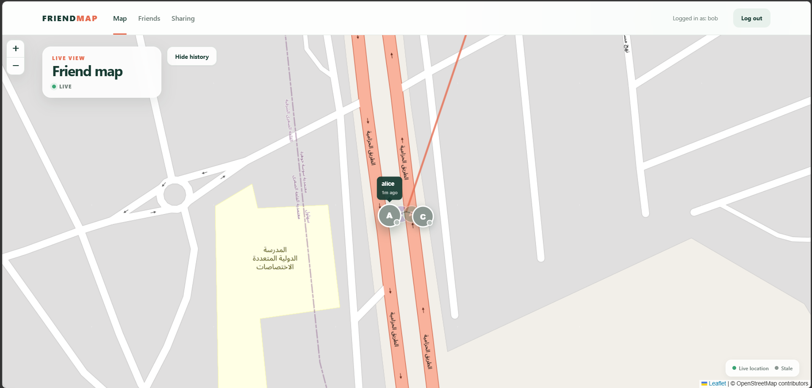
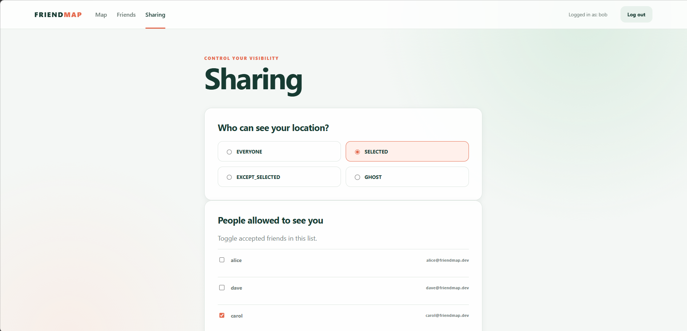
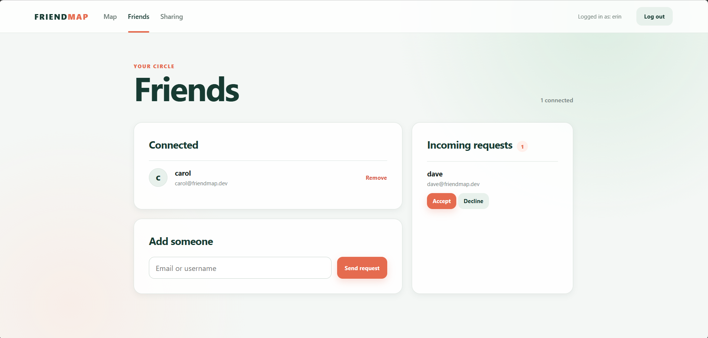
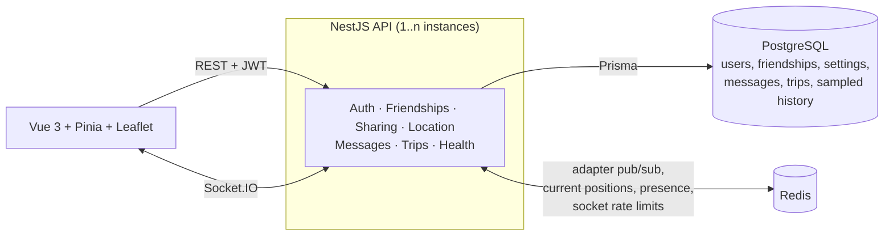

# FriendMap

Real-time location sharing between friends, where **you decide who sees you** — Ghost, Everyone, Selected or Everyone-except — and a change takes effect for people who are already watching, not only on their next visit. Around the map: friend requests, direct messages with private photo attachments, online presence, and meetup planning (trips): invite friends, pick a meet-in-the-middle or fixed spot, and see who has arrived, live.

**NestJS (TypeScript, strict) · Prisma · PostgreSQL · Redis · Socket.IO · Vue 3 · Pinia · Leaflet · Docker Compose · Kubernetes**

## Live demo

**https://majdabbassi.github.io/FriendMap/** (Vue app on GitHub Pages, API on Render, PostgreSQL on Neon, Redis on Upstash — all free tiers)

Sign in as `alice@friendmap.dev` and, in another browser, `bob@friendmap.dev` (password `password123` for both). The free API sleeps after ~15 minutes idle, so the first request can take up to a few minutes. Demo data is wiped and re-seeded on every start. A [Loom walkthrough](https://www.loom.com/share/9f81f4a086174129a44bb644c7677327) shows the app in action.

| Live map with friends' locations | Sharing controls | Friends list |
|---|---|---|
|  |  |  |

## Architecture


```mermaid
flowchart LR
    V[Vue 3 + Pinia + Leaflet] -->|REST + JWT| A
    V <-->|Socket.IO| A
    subgraph API["NestJS API (1..n instances)"]
      A[Auth · Friendships · Sharing · Location<br/>Messages · Trips · Health]
    end
    A -->|Prisma| P[(PostgreSQL<br/>users, friendships, settings,<br/>messages, trips, sampled history)]
    A <-->|adapter pub/sub,<br/>current positions, presence,<br/>socket rate limits| R[(Redis)]
```

**Durable data in PostgreSQL, live data in Redis.** Users, friendships, sharing settings, messages, trips and a sampled location history are stored through Prisma (schema changes are migrations, applied with `prisma migrate deploy` at start). Everything that changes every few seconds lives in Redis: each user's current position, online presence (a key with a 90-second TTL), and the counters that rate-limit socket events. The Socket.IO **Redis adapter** relays room broadcasts between API instances, so a viewer connected to one instance receives positions sent to another.

**Rooms.** Each user has `user:{id}` (chat, presence) and `location:{id}` (the people allowed to see them on the map); each trip has `trip:{id}`.

**How a location update flows.** A client sends a point over the socket. The API rate-limits it (12 per minute per user, in Redis), validates it against the previous point — rejecting points from the future (> 30 s), stale points (> 5 min), out-of-order points and implausible speeds (> 500 km/h) — stores it as the current position, samples it into history (only if ≥ 30 s or ≥ 25 m from the last stored point; history is purged after 24 h), and emits it to the sockets in `location:{id}`.

**How privacy is enforced.** Visibility is checked **when a viewer joins** someone's `location:{id}` room (on connect, for each friend, using one batched query), and **re-checked whenever it could change**: the sharing service emits `sharing.mode-changed` / `sharing.list-changed`, and unfriending emits `friendship.removed`. The location gateway then fetches the sockets in that room across all instances, removes every viewer who is no longer allowed and sends them `location:hidden`; viewers who just became allowed are added and receive the current position. HTTP reads (current locations, history) apply the same `VisibilityService` rules.

**Trips** are an explicit exception: accepting a trip invite means sharing with that group, so `trip:join` adds each member to every other member's `location:{id}` room for the trip map, even if their general sharing is off. A trip moves through `DRAFT → DECIDED → ARCHIVED`; the meetup point is either AUTO (the geographic center of the members) or FIXED, with proposals that members accept; members tap "I'm here" and arrivals are broadcast to the trip room.

**Chat photos** are uploaded through the API, sniffed by magic bytes (PNG, JPEG, GIF, WebP, max 3 MB), stored under random UUID names on a volume, and served only to a logged-in sender or recipient of a message that carries them (`Cache-Control: private`). The web app fetches them with the token and shows them through object URLs.

## Key decisions and trade-offs

1. **Authorize at room join, revoke on change events** — instead of checking visibility for every GPS point.
   *Why:* a moving user sends a point every few seconds to many viewers; a database check per point and per viewer would not scale. Membership of `location:{id}` *is* the permission, so a broadcast is a plain room emit. *Cost:* correctness depends on every path that can change visibility emitting an event (mode, list, unfriend); the mode-change and unfriend paths have unit tests (the list-change path reuses the same handler), and the e2e suite checks stop/resume viewing.
2. **Redis for live state, PostgreSQL for history.**
   *Why:* current positions and presence are overwritten constantly and only matter now, which suits an in-memory store with TTLs; history and relations need durability and queries. *Cost:* Redis is a hard dependency — without it there is no realtime.
3. **The Socket.IO Redis adapter from day one.**
   *Why:* WebSocket connections are sticky to one process; with the adapter, any number of API pods behave like one (the Kubernetes manifests run 3). *Cost:* every broadcast goes through Redis pub/sub, even with a single instance.
4. **Store a sampled history for 24 hours only.**
   *Why:* enough to draw your own recent trail; keeping every point forever would be a privacy liability and a write-heavy table. *Cost:* no long-term history or analytics.
5. **Short-lived access tokens with rotating refresh tokens.**
   *Why:* a 15-minute access token limits the damage of a leak; refresh tokens (7 days) are stored, rotated on use and revoked on logout. *Cost:* the client must refresh transparently (the web API client does).
6. **Repository layer with batch queries.**
   *Why:* friend lists drive almost every screen; batching visibility and friendship lookups (`canViewMany`) avoids N+1 queries as lists grow.

## Security model

- **Authentication:** JWT access tokens (15 min) and rotated refresh tokens (7 days), revoked on logout. Sockets authenticate with the access token.
- **Authorization:** friendship and sharing rules are checked on HTTP routes, socket joins and history reads; messages only between friends; trip actions only for members (archive and delete for the trip admin).
- **Rate limits:** auth routes per IP (login 3/min, register 5/min, refresh and logout 10/min) and 20 requests/min per route by default, kept in memory per instance (NestJS throttler); socket events (location, messages, reads, trips) limited through Redis, so the limit is shared by all instances.
- **Attachments:** content-sniffed, size-capped, random names, private to the two people in the conversation; a deleted message takes its photo with it.
- **Platform:** Helmet headers, environment validated at boot (insecure defaults such as a short `JWT_SECRET` are rejected), non-root containers, every Docker port bound to `127.0.0.1`.

**Review findings (fixed):** chat photos used to be public at `/uploads/...` to anyone with the URL — they now require a login and a message in common, with an e2e test covering the sender, the recipient, a third friend and a deleted message. In Docker, uploads failed with `EACCES` for the non-root user and the demo users were not seeded; both fixed.

## Features

- **Live map** with friends' positions, a "stop viewing" toggle per friend, and your own 24-hour history.
- **Four sharing modes** (Ghost, Everyone, Selected, Except-selected) with friend lists.
- **Friendships:** send, accept, reject, remove.
- **Direct messages** with read receipts, image attachments, unread badges and toasts; **online presence**.
- **Trips:** invite accepted friends, propose a time, meet-in-the-middle or fixed spot with proposals, live trip map, trip chat with typing indicator, arrival tracking, archive or leave.
- **API docs:** Swagger/OpenAPI at `/docs`, generated from the DTOs. **Health:** `/health` checks PostgreSQL, Redis, memory and disk.

## Quick start (Docker Compose)

```bash
git clone https://github.com/Majdabbassi/FriendMap.git
cd FriendMap
cp .env.example .env
# Edit .env with your secure values
docker compose up --build
```

- Web app: <http://localhost:8080>
- API: <http://localhost:3000> · Swagger: <http://localhost:3000/docs> · Health: <http://localhost:3000/health>

Five demo users are seeded on start-up (`SEED_DEMO`, on by default in Compose): `alice`, `bob`, `carol`, `dave`, `erin` `@friendmap.dev`, password `password123`. Friendships: alice↔bob, alice↔carol, bob↔carol, bob↔dave, carol↔erin. Log in as alice and bob in two browsers, have alice create a trip and invite bob, and walk through the whole meetup flow.

## Environment variables

```bash
# Database
POSTGRES_USER=friendmap
POSTGRES_PASSWORD=your-strong-password
POSTGRES_DB=friendmap

# JWT (generate with: openssl rand -base64 32)
JWT_SECRET=your-jwt-secret-min-32-characters

# Redis
REDIS_HOST=localhost
REDIS_PORT=6379
REDIS_PASSWORD=your-redis-password
# REDIS_TLS=true for managed Redis such as Upstash

# Application
PORT=3000
NODE_ENV=development
VITE_API_URL=http://localhost:3000
# CORS_ORIGINS=http://localhost:5173   SEED_DEMO=true
```

`JWT_SECRET`, `DATABASE_URL`, `REDIS_PASSWORD` and `NODE_ENV` are validated at boot.

## Tests

```bash
cd apps/api
npm test              # 109 unit tests (Jest)
npm run test:e2e      # 21 end-to-end tests, needs PostgreSQL + Redis (see docker-compose.yml)
npm run lint

cd ../web
npm run test:unit     # 36 tests (Vitest)
npm run build
```

- **Unit (API):** auth and refresh-token rotation, the visibility rules for all four modes, friendship transitions, location validation, the location and message gateways (connection, rate limiting, privacy, read receipts), presence, trips (invites, admin-only actions, meetup and proposal rules), attachments.
- **End-to-end (real PostgreSQL + Redis):** register → login → refresh rotation → logout revocation; friendship access; rejected socket connections, a location broadcast between friends, stop/resume viewing; chat delivery and persistence, private image attachments, messaging a non-friend refused, presence; the full trip lifecycle (create → invite → accept → chat → meetup → arrive), membership enforcement and `trip:join` access.
- **Web:** the API client's token handling and the auth, presence and chat stores.

GitHub Actions runs all three suites on every push (the e2e suite against PostgreSQL and a password-protected Redis) and builds the web app.

## Free deployment

| Piece | Host | Free tier |
|---|---|---|
| SPA (Vue) | GitHub Pages | always on |
| API + WebSockets (NestJS) | Render free web service | sleeps after 15 min idle |
| PostgreSQL | Neon | 512 MB, always on |
| Redis | Upstash | 256 MB, always on |

1. **PostgreSQL (Neon)** — create a project and copy the direct (non-pooled) connection string.
2. **Redis (Upstash)** — create a database; note host, port and password (TLS via `REDIS_TLS=true`).
3. **API (Render)** — **New → Blueprint**, select this repo; `render.yaml` creates `friendmap-api`. Set `DATABASE_URL`, `REDIS_HOST`, `REDIS_PORT`, `REDIS_PASSWORD`. `JWT_SECRET` is generated; `SEED_DEMO=true`, `CORS_ORIGINS=https://majdabbassi.github.io` and `REDIS_TLS=true` are pre-filled. `NODE_ENV=production` is set in the start command (not the build), because a production build environment makes `npm ci` skip the Prisma CLI.
4. **SPA (GitHub Pages)** — Settings → Pages → Source: GitHub Actions. `friendmap-pages.yml` builds under `/FriendMap/` with a SPA fallback. If your API URL differs, set the repository variable `FRIENDMAP_API_URL` and update `CORS_ORIGINS`.

**Free-tier caveats:** one API instance; chat photos live on the instance's ephemeral disk and reset on redeploy; everything else persists in Neon and Upstash.

## Kubernetes

```bash
cd k8s
cp secrets.yaml.template secrets.yaml   # then fill in real secrets
# Update image references in api-deployment.yaml / web-deployment.yaml
kubectl apply -f configmap.yaml -f secrets.yaml
kubectl apply -f postgres-pvc.yaml -f redis-pvc.yaml
kubectl apply -f postgres-deployment.yaml -f postgres-service.yaml
kubectl apply -f redis-deployment.yaml -f redis-service.yaml
kubectl apply -f api-deployment.yaml -f api-service.yaml
kubectl apply -f web-deployment.yaml -f web-service.yaml
kubectl apply -f ingress.yaml
```

Layout: API (3 replicas), web (2), PostgreSQL (1), Redis (1). Roll back with `kubectl rollout undo deployment/<name>`.

## Scaling notes

- **API pods are stateless:** current positions and presence are in Redis, and the adapter fans out broadcasts, so any pod can serve any connection. Add replicas as connections grow; move Redis to cluster mode when pub/sub volume demands it.
- **Database:** composite indexes on the hot queries and batched visibility checks keep reads flat as friend lists grow; add PgBouncer or read replicas under contention; partition the history table (or move it to a time-series store) at very large write volumes.
- **HTTP rate limits** are per instance today; with several pods they should move to a Redis-backed throttler storage like the socket limits.

## Data model

- **User**: email, username, password hash · **RefreshToken**: token, expiry
- **Friendship**: requester / addressee, status (PENDING / ACCEPTED)
- **SharingSettings**: mode (GHOST / EVERYONE / SELECTED / EXCEPT_SELECTED) · **SharingListEntry**: owner, friend, list type
- **LocationHistoryPoint**: sampled points, 24-hour retention
- **Message**: sender, recipient, optional body, `readAt`, optional `imageUrl`, soft delete (`deletedAt`) propagated live
- **Trip**: name, creator, status, meetup mode (AUTO / FIXED) with an optional pending proposal, meeting time · **TripMember**: role (ADMIN / MEMBER), `arrivedAt` · **TripInvite**: status, `respondedAt` · **TripMessage**: per-trip chat

## Not done yet

Prometheus metrics and distributed tracing; Redis cluster mode; shared (Redis) storage for the HTTP rate limits.
